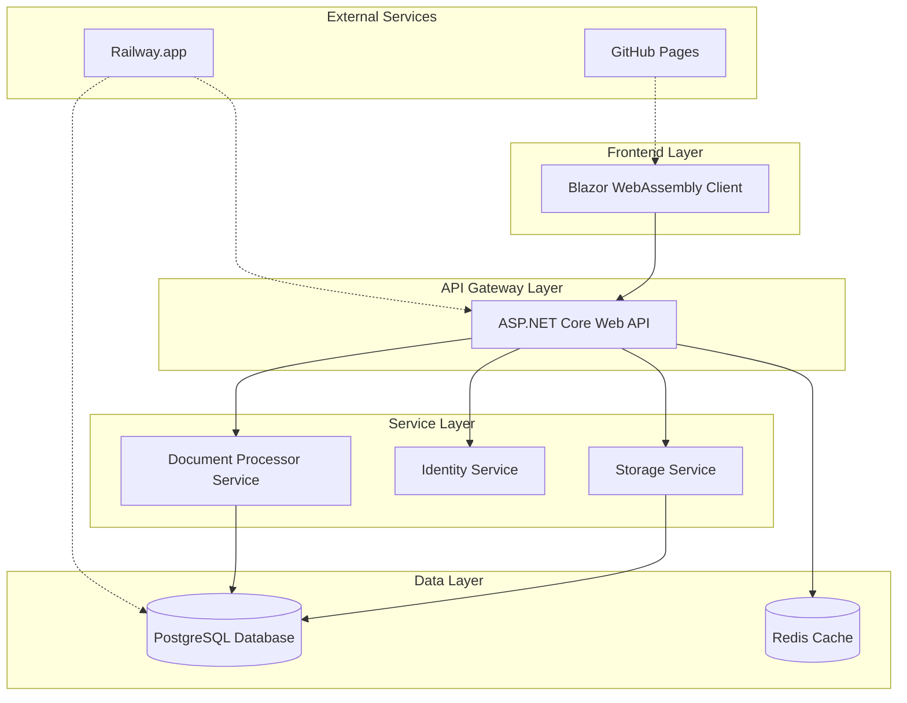
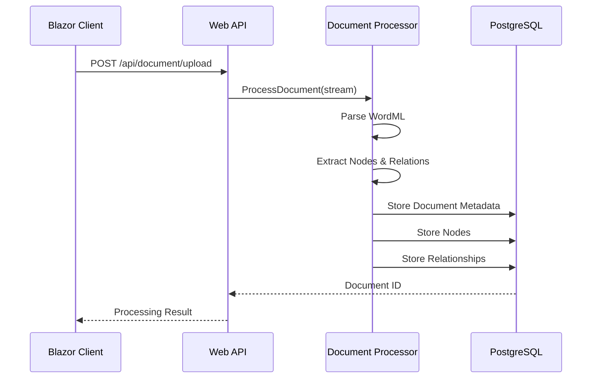
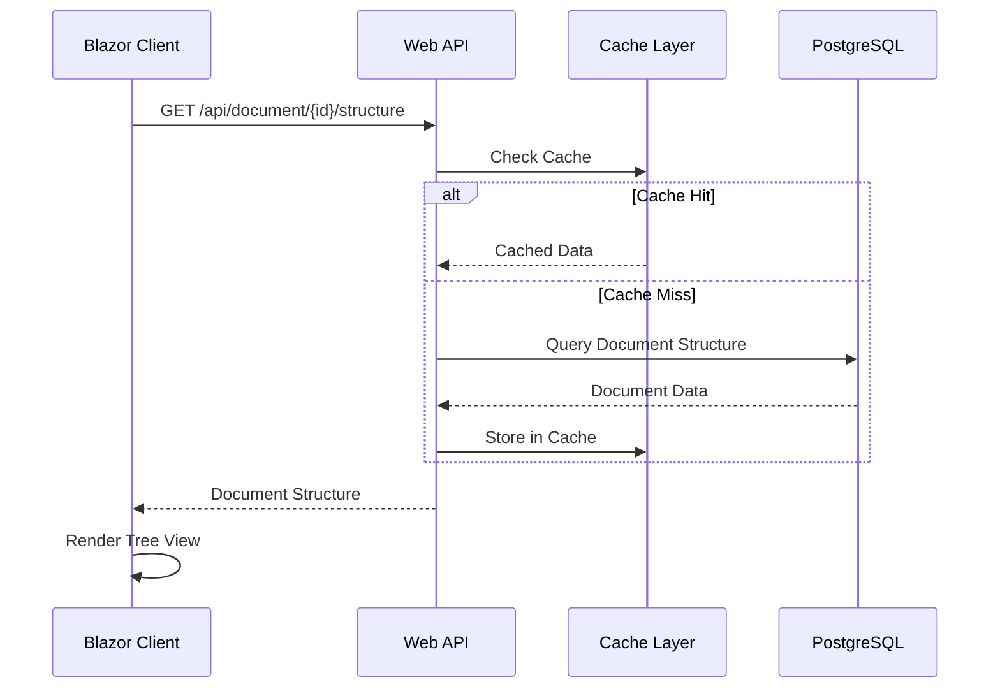

# Architecture Overview

## 🏗️ System Architecture

LogicLoom follows a microservices architecture pattern designed for document processing and analysis. The system is built with separation of concerns, scalability, and maintainability in mind.

## 🎯 High-Level Architecture



## 🧩 Components

### Frontend Layer
- **Blazor WebAssembly Client**: Interactive web UI for document upload, analysis, and visualization
- **Static Hosting**: Deployed on GitHub Pages or Netlify for global CDN distribution

### API Gateway Layer
- **ASP.NET Core Web API**: RESTful API serving as the main entry point
- **Authentication**: JWT-based authentication with ASP.NET Core Identity
- **CORS Configuration**: Secure cross-origin resource sharing setup

### Service Layer
- **Document Processor Service**: WordML parsing and analysis using OpenXML SDK
- **Identity Service**: User management and authentication
- **Storage Service**: Data access layer with Entity Framework Core

### Data Layer
- **PostgreSQL Database**: Primary data store for documents, nodes, and relationships
- **Redis Cache**: (Optional) Caching layer for improved performance

## 📊 Data Flow

### Document Upload & Processing


### Document Retrieval & Visualization


## 🏛️ Architecture Patterns

### 1. **Microservices Architecture**
- Loosely coupled services
- Independent deployment capabilities
- Service-specific databases
- API-first communication

### 2. **Repository Pattern**
- Data access abstraction
- Testable data layer
- Consistent data operations
- Easy to mock for testing

### 3. **Dependency Injection**
- Inversion of control
- Testable components
- Flexible service registration
- Lifetime management

### 4. **CQRS (Command Query Responsibility Segregation)**
- Separate read and write operations
- Optimized queries
- Scalable architecture
- Clear responsibility separation

## 🔧 Technology Stack

### Backend Technologies
```yaml
Framework: ASP.NET Core 8.0
Language: C# 12
Database: PostgreSQL 15+
ORM: Entity Framework Core 8.0
Document Processing: DocumentFormat.OpenXml
Authentication: ASP.NET Core Identity
API Documentation: Swagger/OpenAPI
Testing: xUnit, Moq
```

### Frontend Technologies
```yaml
Framework: Blazor WebAssembly
Language: C# 12
Styling: CSS3 with CSS Variables
Charts: Chart.js integration
HTTP Client: HttpClient with JSON
State Management: Component-based state
Routing: Blazor Router
```

### Infrastructure
```yaml
Hosting: Railway.app (recommended)
Database Hosting: Railway PostgreSQL
Frontend Hosting: GitHub Pages
CI/CD: GitHub Actions
Monitoring: Built-in Railway monitoring
Logging: ASP.NET Core Logging
```

## 📁 Project Structure

```
src/
├── LogicLoom.Api/                  # Web API Layer
│   ├── Controllers/               # API Controllers
│   ├── Properties/               # Launch settings
│   └── Program.cs               # Application entry point
│
├── LogicLoom.Client/             # Blazor WebAssembly
│   ├── Components/              # Reusable UI components
│   ├── Layout/                  # Layout components
│   ├── Pages/                   # Page components
│   ├── Services/                # Client-side services
│   └── wwwroot/                # Static assets
│
├── LogicLoom.DocumentProcessor/  # Document Processing
│   ├── Models/                  # Processing models
│   ├── Services/                # Processing services
│   └── Interfaces/              # Service contracts
│
├── LogicLoom.Storage/           # Data Access Layer
│   ├── Migrations/              # EF Core migrations
│   └── DocumentDbContext.cs    # Database context
│
├── LogicLoom.Shared/            # Shared Components
│   ├── Models/                  # Shared models
│   └── Interfaces/              # Shared interfaces
│
├── LogicLoom.Shared.Models/     # Data Models
│   └── *.cs                     # Domain models
│
└── LogicLoom.Identity/          # Identity Service
    ├── Models/                  # Identity models
    └── Services/                # Auth services
```

## 🚀 Deployment Architecture

### Development Environment
```yaml
API: localhost:5022 (HTTP), localhost:7022 (HTTPS)
Client: localhost:5024 (HTTP), localhost:7001 (HTTPS)
Database: Local PostgreSQL or SQLite
```

### Production Environment
```yaml
API: https://your-app.railway.app
Client: https://yourusername.github.io/LogicLoom
Database: Railway PostgreSQL (managed)
SSL: Automatic (Railway + GitHub Pages)
```

## 🔒 Security Architecture

### Authentication & Authorization
- **ASP.NET Core Identity**: User management
- **JWT Tokens**: Stateless authentication
- **Role-based Access**: Future extensibility
- **CORS Policy**: Restricted origins

### Data Security
- **TLS 1.3**: All communications encrypted
- **Database Encryption**: At-rest encryption
- **Environment Variables**: Secure configuration
- **Input Validation**: Comprehensive validation

### Document Processing Security
- **Container Isolation**: Isolated processing environment
- **File Validation**: Type and size restrictions
- **Memory Processing**: No persistent file storage
- **Malware Scanning**: Future enhancement capability

## 📈 Scalability Considerations

### Horizontal Scaling
- **Stateless API**: Easy to scale horizontally
- **Database Connection Pooling**: Efficient resource usage
- **CDN Frontend**: Global distribution capability
- **Microservice Architecture**: Independent scaling

### Performance Optimization
- **Database Indexing**: Optimized queries
- **Caching Strategy**: Redis integration ready
- **Lazy Loading**: Efficient data loading
- **Pagination**: Large dataset handling

## 🔮 Future Enhancements

### Planned Features
- **Message Queue**: RabbitMQ for async processing
- **Elasticsearch**: Advanced search capabilities
- **Docker Containers**: Containerized deployment
- **Kubernetes**: Orchestrated scaling

### Monitoring & Observability
- **Application Insights**: Performance monitoring
- **Structured Logging**: Searchable logs
- **Health Checks**: System monitoring
- **Metrics Dashboard**: Operational insights

This architecture provides a solid foundation for document processing while maintaining flexibility for future growth and enhancements.
