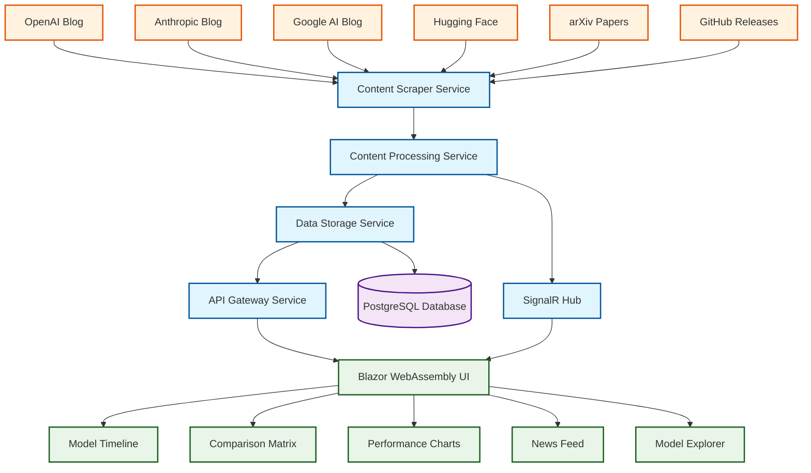
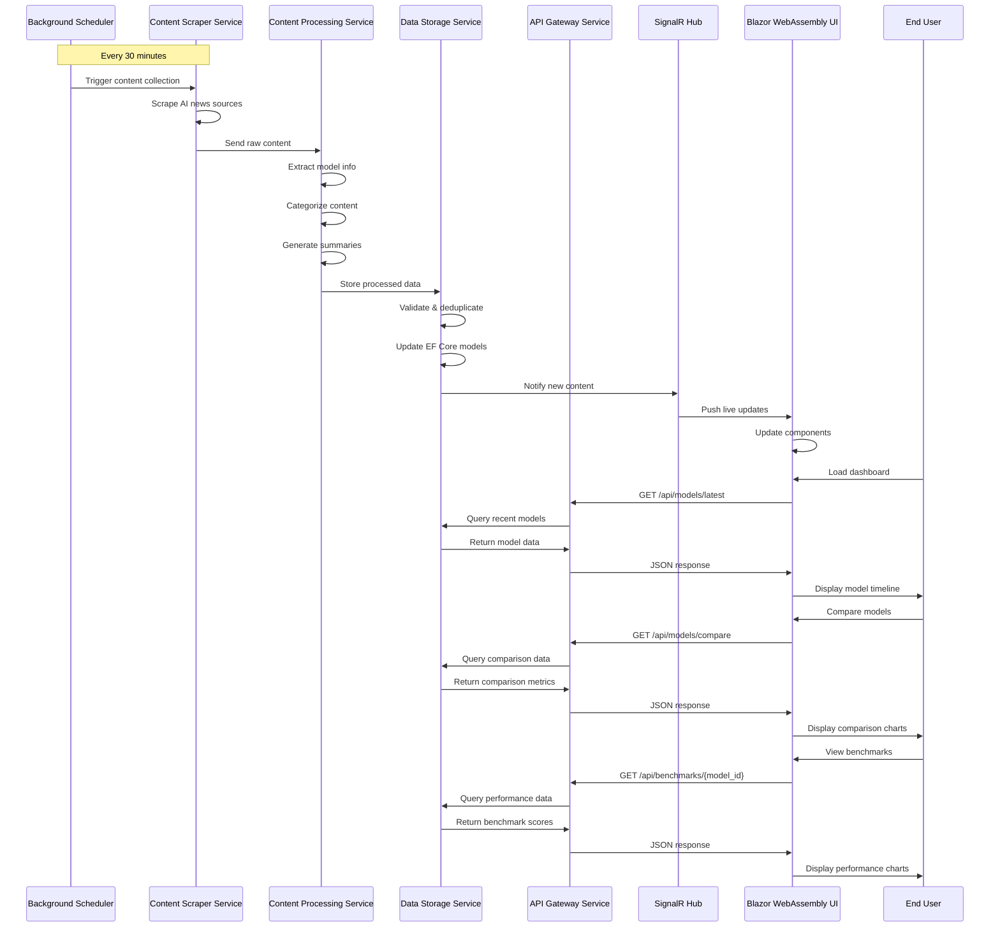
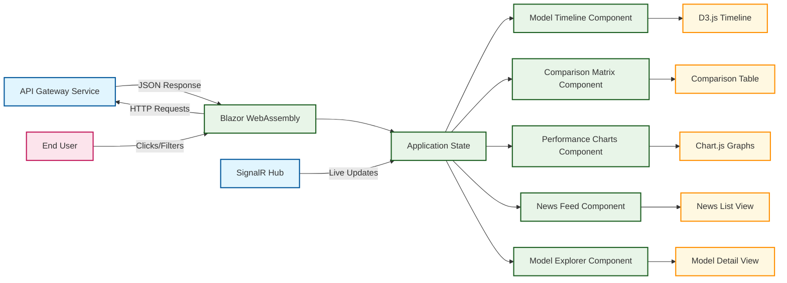

# AI News Aggregation Architecture

## 📌 Project Overview
LogicLoom will serve as an **AI News Aggregation Platform** that automatically gathers, processes, and presents the latest developments in artificial intelligence, focusing on model releases, research breakthroughs, and industry trends.

### 🎯 Core Objectives
- **Automated Content Discovery**: Scrape and monitor AI research sources, company blogs, and news outlets
- **Real-time Updates**: Provide users with the latest AI model announcements and comparisons
- **Historical Tracking**: Maintain timeline of AI model evolution and performance metrics
- **Interactive Visualization**: Display model capabilities, benchmarks, and release timelines
- **GitHub Pages Frontend**: Accessible web interface for users to explore AI developments

---

## 🤖 Latest AI Models Overview (2024-2025)

### 🔥 Recent Major Releases

#### **GPT-4o & GPT-5 (OpenAI)**
- **Release**: GPT-4o (May 2024), GPT-5 (Expected 2025)
- **Key Features**:
  - Multimodal capabilities (text, image, audio, video)
  - Real-time voice interaction
  - Improved reasoning and reduced hallucinations
  - 50% cost reduction vs GPT-4
- **Pros**:
  ✅ Excellent multimodal integration  
  ✅ Fast inference speed  
  ✅ Strong coding capabilities  
  ✅ Reliable for production use  
- **Cons**:
  ❌ Limited context window (128K tokens)  
  ❌ Expensive for high-volume usage  
  ❌ API rate limits  

#### **Claude 3.5 Sonnet & Claude 4 (Anthropic)**
- **Release**: Claude 3.5 (June 2024), Claude 4 (Expected Q2 2025)
- **Key Features**:
  - 200K context window
  - Enhanced safety and constitutional AI
  - Superior code generation
  - Artifact creation capabilities
- **Pros**:
  ✅ Massive context window  
  ✅ High safety standards  
  ✅ Excellent for long documents  
  ✅ Strong analytical reasoning  
- **Cons**:
  ❌ Limited multimodal features  
  ❌ Slower inference than GPT-4o  
  ❌ Less creative writing capability  

#### **DeepSeek V2.5 & V3 (DeepSeek)**
- **Release**: V2.5 (September 2024), V3 (January 2025)
- **Key Features**:
  - Open-source model
  - Competitive performance at lower cost
  - Strong mathematics and coding
  - Mixture of Experts (MoE) architecture
- **Pros**:
  ✅ Open-source and customizable  
  ✅ Cost-effective deployment  
  ✅ Strong STEM capabilities  
  ✅ Active community support  
- **Cons**:
  ❌ Requires technical expertise  
  ❌ Limited multimodal features  
  ❌ Smaller ecosystem vs. OpenAI  

#### **Gemini 2.0 & Gemini Ultra (Google)**
- **Release**: Gemini 2.0 (December 2024), Ultra (Q1 2025)
- **Key Features**:
  - Native multimodal architecture
  - Integration with Google services
  - Advanced reasoning capabilities
  - 2M token context window
- **Pros**:
  ✅ Exceptional multimodal performance  
  ✅ Google ecosystem integration  
  ✅ Large context window  
  ✅ Strong factual accuracy  
- **Cons**:
  ❌ Limited third-party integrations  
  ❌ Strict content policies  
  ❌ Inconsistent API availability  

---

## 🏗 Technical Architecture for AI News Aggregation

### Service Call Flow Architecture



### Detailed Service Flow & Data Pipeline



### Backend Services (C# Microservices)

#### **1. Content Scraper Service**
```csharp
// Responsibilities:
- Monitor RSS feeds from AI research organizations
- Scrape company blogs (OpenAI, Anthropic, Google AI)
- Track GitHub releases for open-source models
- Parse academic papers from arXiv

// Key Components:
- IScrapingService interface
- HttpClient with rate limiting
- RSS feed parsers
- HTML content extractors
- Scheduled background jobs
```

#### **2. Content Processing Service**
```csharp
// Responsibilities:
- Extract model information and specifications
- Categorize content (model release, research, news)
- Generate summaries using local LLM
- Identify key metrics and benchmarks

// Key Components:
- IContentProcessor interface
- ML.NET classification models
- Natural language processing
- Entity extraction algorithms
- Content validation logic
```

#### **3. Data Storage Service**
```csharp
// Entity Framework Models:
- AIModel (name, version, company, release_date, capabilities)
- Article (title, content, source, publish_date, category)
- Benchmark (model_id, test_name, score, date)
- ModelComparison (model1_id, model2_id, comparison_data)

// Key Components:
- DbContext with EF Core
- Repository pattern implementation
- Data validation and constraints
- Caching layer (Redis/Memory)
- Database migrations
```

#### **4. API Gateway Service**
```csharp
// Endpoints:
GET /api/models/latest          - Recent model releases
GET /api/models/compare         - Model comparison data
GET /api/news/trending          - Trending AI news
GET /api/benchmarks/{model_id}  - Performance metrics

// Key Components:
- ASP.NET Core Web API
- Swagger/OpenAPI documentation
- Rate limiting middleware
- Authentication/Authorization
- CORS configuration
- Response caching
```

### Frontend (Blazor WebAssembly on GitHub Pages)

#### **Data Flow to UI Components**



#### **Dashboard Components**
- **Model Timeline**: Interactive timeline of AI model releases
- **Comparison Matrix**: Side-by-side model capabilities
- **Performance Charts**: Benchmark scores visualization
- **News Feed**: Latest AI developments
- **Model Explorer**: Detailed model specifications

#### **Component Data Flow Details**

```mermaid
flowchart TD
    %% API Endpoints
    API1[GET /api/models/latest] --> |Model[]| Timeline[Model Timeline Component]
    API2[GET /api/models/compare] --> |ComparisonData| Matrix[Comparison Matrix]
    API3[GET /api/benchmarks/:id] --> |BenchmarkData| Charts[Performance Charts]
    API4[GET /api/news/trending] --> |NewsArticle[]| Feed[News Feed]
    API5[GET /api/models/:id] --> |ModelDetails| Explorer[Model Explorer]
    
    %% Component Processing
    Timeline --> |Transform Data| D3Timeline[D3.js Timeline Visualization]
    Matrix --> |Create Table| CompTable[Interactive Comparison Table]
    Charts --> |Process Metrics| ChartJS[Chart.js Bar/Line Charts]
    Feed --> |Format Articles| NewsList[Paginated News List]
    Explorer --> |Display Details| ModelView[Detailed Model View]
    
    %% User Actions
    User[User Interactions] --> Filter[Filter/Search Actions]
    Filter --> Timeline
    Filter --> Matrix
    Filter --> Charts
    Filter --> Feed
    Filter --> Explorer
    
    %% Real-time Updates
    SignalR[SignalR Notifications] --> |New Model Alert| Timeline
    SignalR --> |Breaking News| Feed
    SignalR --> |Benchmark Update| Charts
    
    %% Styling
    classDef api fill:#e3f2fd,stroke:#1976d2,stroke-width:2px
    classDef component fill:#f1f8e9,stroke:#388e3c,stroke-width:2px
    classDef visualization fill:#fff3e0,stroke:#f57c00,stroke-width:2px
    classDef interaction fill:#fce4ec,stroke:#c2185b,stroke-width:2px
    
    class API1,API2,API3,API4,API5 api
    class Timeline,Matrix,Charts,Feed,Explorer component
    class D3Timeline,CompTable,ChartJS,NewsList,ModelView visualization
    class User,Filter,SignalR interaction
```

#### **Data Visualization Libraries**
- **Chart.js**: Performance benchmark charts
- **D3.js**: Interactive timeline and network graphs
- **Plotly.js**: 3D capability mapping

---

## 📊 Data Sources & APIs

### Primary Sources
| Source | Type | Update Frequency |
|--------|------|-----------------|
| **OpenAI Blog** | Company Updates | Weekly |
| **Anthropic Blog** | Research Papers | Bi-weekly |
| **Google AI Blog** | Technical Posts | Weekly |
| **Hugging Face Hub** | Model Releases | Daily |
| **arXiv CS.AI** | Academic Papers | Daily |
| **Papers With Code** | Benchmarks | Daily |
| **GitHub Trending** | Open Source | Daily |

### Content Processing Pipeline
1. **Ingestion**: Automated scraping with rate limiting
2. **Classification**: ML-based content categorization
3. **Extraction**: Parse model specs, benchmarks, and metadata
4. **Enrichment**: Cross-reference with existing data
5. **Validation**: Quality checks and duplicate detection
6. **Storage**: Persist to PostgreSQL with EF Core

---

## 🔄 Real-time Update Strategy

### Scheduled Jobs
```csharp
// Background Services
- ContentScraperJob: Every 30 minutes
- BenchmarkUpdateJob: Daily at 2 AM UTC
- ModelComparisonJob: Weekly on Sundays
- TrendingAnalysisJob: Every 6 hours
```

### WebSocket Integration
- Real-time notifications for breaking AI news
- Live updates when new models are announced
- Push notifications for significant benchmark improvements

---

## 📈 Success Metrics & KPIs

### User Engagement
- **Daily Active Users**: Target 100+ within 3 months
- **Session Duration**: Average 5+ minutes
- **Return Rate**: 40%+ weekly return users

### Content Quality
- **Update Latency**: New models detected within 1 hour
- **Accuracy Rate**: 95%+ correct model information
- **Coverage**: Track 50+ major AI companies/labs

### Technical Performance
- **API Response Time**: <500ms for 95th percentile
- **Uptime**: 99.5% availability
- **Data Freshness**: Content updated within 24 hours

---

## 🚀 Implementation Roadmap

### Phase 1: Foundation (Weeks 1-4)
- [ ] Setup microservice architecture
- [ ] Implement basic content scraper
- [ ] Create EF Core data models
- [ ] Deploy to Render.com free tier

### Phase 2: Core Features (Weeks 5-8)
- [ ] Build model comparison engine
- [ ] Develop Blazor frontend components
- [ ] Integrate Chart.js for visualizations
- [ ] Deploy frontend to GitHub Pages

### Phase 3: Enhancement (Weeks 9-12)
- [ ] Add real-time updates via SignalR
- [ ] Implement ML-based content classification
- [ ] Create mobile-responsive design
- [ ] Add user personalization features

### Phase 4: Scale & Polish (Weeks 13-16)
- [ ] Optimize performance and caching
- [ ] Add comprehensive testing
- [ ] Implement monitoring and alerting
- [ ] Create documentation and API specs

---

## 💡 Future Enhancements

### Advanced Features
- **AI-Powered Summaries**: Use local LLM to generate article summaries
- **Trend Prediction**: ML models to predict AI development trends
- **Community Features**: User comments and model ratings
- **API Marketplace**: Expose data APIs for developers

### Monetization Options
- **Premium Tiers**: Advanced analytics and early access
- **API Access**: Paid tiers for high-volume API usage
- **Custom Reports**: Personalized AI trend reports
- **Enterprise Features**: White-label solutions

---

## 🔗 Technical Resources

### Development Tools
- [ASP.NET Core](https://learn.microsoft.com/aspnet/core) - Backend framework
- [Entity Framework Core](https://learn.microsoft.com/ef/core) - ORM
- [Blazor WebAssembly](https://learn.microsoft.com/aspnet/core/blazor) - Frontend
- [Chart.js](https://www.chartjs.org/) - Data visualization
- [Supabase](https://supabase.com/) - PostgreSQL hosting

### AI/ML Libraries
- [ML.NET](https://dotnet.microsoft.com/apps/machinelearning-ai/ml-dotnet) - Content classification
- [HtmlAgilityPack](https://html-agility-pack.net/) - Web scraping
- [AngleSharp](https://anglesharp.github.io/) - HTML parsing

### Deployment & Hosting
- [Render.com](https://render.com/) - Backend hosting
- [GitHub Pages](https://pages.github.com/) - Frontend hosting
- [GitHub Actions](https://github.com/features/actions) - CI/CD pipeline

---

*Last Updated: August 24, 2025*
