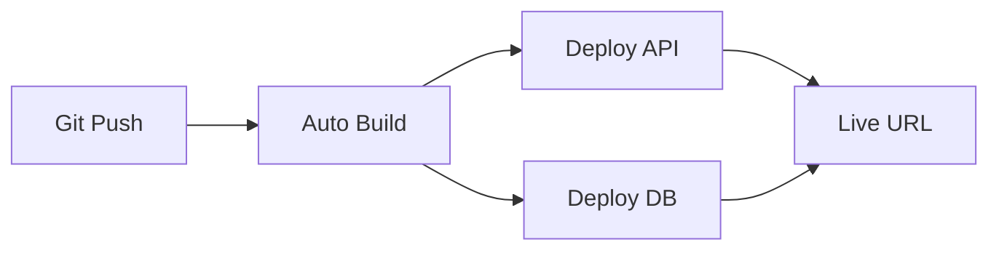

# Railway vs Alternatives: Deployment Comparison for LogicLoom

## 🎯 Executive Summary

| Aspect | Railway | Render | Fly.io | Azure/AWS |
|--------|---------|--------|--------|-----------|
| **Best for** | Document processing hobby projects | Railway alternative | Global performance | Enterprise scale |
| **Setup Time** | 5 minutes | 15 minutes | 30 minutes | 2+ hours |
| **Free Tier** | $5 credit/month | 750 hours free | $5 credit | 12 months free |
| **Learning Curve** | Minimal | Low | Medium | Steep |
| **Recommended for LogicLoom** | ✅ **BEST CHOICE** | 🥈 **Alternative** | 🥉 **Complex** | ❌ **Overkill** |

---

## 💰 Cost Comparison

### Railway.app
```
Free Tier:
- $5 monthly credit (resets each month)
- 512MB RAM
- 1GB disk space
- Automatic sleep after inactivity
- PostgreSQL included

Paid Plans:
- Developer: $5/month (no sleep, more resources)
- Team: $20/month (multiple environments)
```

### Azure
```
Free Tier (12 months):
- App Service: 10 web apps, 1GB storage
- SQL Database: 250MB
- Azure Functions: 1M requests/month
- Storage: 5GB

Always Free:
- App Service: Limited hours/month
- Functions: 1M requests/month
- CosmosDB: 1000 RU/s + 25GB

Production Costs:
- App Service: $13-200+/month
- SQL Database: $5-500+/month
- Storage: $0.02/GB/month
```

---

## 🚀 Deployment Experience

### Railway: Simple & Fast
```bash
# 3-step deployment
1. Connect GitHub repo
2. Auto-detect .NET app
3. Add PostgreSQL service
# ✅ Done in 5 minutes!
```

**Pros:**
- Zero configuration needed
- Automatic CI/CD from Git
- Built-in PostgreSQL
- Simple environment variables
- Excellent developer experience

**Cons:**
- Limited customization
- Newer platform (less enterprise features)
- Resource limits on free tier

### Azure: Powerful but Complex
```bash
# Multi-step deployment
1. Create Resource Group
2. Create App Service Plan
3. Create Web App
4. Configure deployment
5. Create SQL Database
6. Configure connection strings
7. Set up Application Insights
8. Configure custom domain/SSL
```

**Pros:**
- Enterprise-grade features
- Extensive customization
- Global CDN and regions
- Advanced monitoring & analytics
- Integration with Microsoft ecosystem
- Scalability to millions of users

**Cons:**
- Steep learning curve
- Complex pricing model
- Over-engineered for small projects
- Requires more maintenance

---

## 🛠 Technical Comparison

### For Your LogicLoom Project

| Feature | Railway | Azure |
|---------|---------|-------|
| **ASP.NET Core Support** | ✅ Excellent | ✅ Excellent |
| **PostgreSQL** | ✅ Built-in | ✅ Azure Database |
| **File Storage** | ⚠️ Limited | ✅ Blob Storage |
| **Auto-scaling** | ⚠️ Basic | ✅ Advanced |
| **Custom Domains** | ✅ Easy | ✅ Advanced |
| **SSL Certificates** | ✅ Automatic | ✅ Automatic |
| **Monitoring** | ✅ Basic logs | ✅ Application Insights |
| **Backup & Recovery** | ✅ Automatic | ✅ Advanced |

---

## 📊 Detailed Analysis

### Railway: Perfect for Starting Out

#### Strengths for LogicLoom:
1. **Rapid Deployment**: Push to Git = instant deployment
2. **Zero DevOps**: No need to learn cloud architecture
3. **Cost Predictable**: $5 credit covers most hobby usage
4. **PostgreSQL Included**: No separate database setup
5. **Environment Management**: Easy staging/production splits

#### Current Setup for Railway:
```toml
# railway.toml (already configured)
[build]
builder = "NIXPACKS"

[deploy]
startCommand = "dotnet LogicLoom.Api.dll"
healthcheckPath = "/health"
```

#### Railway Deployment Flow:


### Azure: Enterprise-Ready

#### Strengths for LogicLoom:
1. **Scalability**: Handle millions of documents
2. **Global Reach**: Deploy to multiple regions
3. **Advanced Features**: AI integration, advanced analytics
4. **Enterprise Security**: RBAC, Key Vault, etc.
5. **Microsoft Ecosystem**: Integration with Office, Teams

#### Azure Architecture for LogicLoom:
```yaml
# Azure setup (requires configuration)
Resource Group: LogicLoom-RG
App Service Plan: LogicLoom-ASP (Linux, B1)
Web App: logicloom-api
SQL Database: logicloom-db
Storage Account: logicloomblobstorage
Application Insights: logicloom-insights
```

---

## 🎯 Recommendations Based on Your Situation

### Phase 1: Start with Railway (NOW)
**Why Railway First:**
- You have a working MVP
- Want to get online quickly
- Learning deployment concepts
- Validating your idea
- Free tier covers initial usage

**Setup Time:** 30 minutes
**Cost:** $0/month initially

### Phase 2: Evaluate Azure (LATER)
**When to Consider Azure:**
- Your app gains significant users (1000+)
- Need advanced features (AI, analytics)
- Require multiple environments
- Need enterprise compliance
- Want to integrate with Microsoft tools

**Migration Effort:** 2-3 days
**Cost:** $50-200/month for production

---

## 🔄 Migration Strategy (Railway → Azure)

When you're ready to scale:

### 1. Database Migration
```bash
# Export from Railway PostgreSQL
pg_dump $RAILWAY_DATABASE_URL > logicloom_backup.sql

# Import to Azure Database for PostgreSQL
psql $AZURE_DATABASE_URL < logicloom_backup.sql
```

### 2. Application Deployment
```yaml
# Azure App Service deployment
- name: Deploy to Azure
  uses: azure/webapps-deploy@v2
  with:
    app-name: logicloom-api
    package: ./publish
```

### 3. Configuration Updates
```json
// Azure-specific appsettings.json
{
  "ConnectionStrings": {
    "DefaultConnection": "Azure SQL connection string"
  },
  "ApplicationInsights": {
    "InstrumentationKey": "your-key"
  }
}
```

---

## 📈 Growth Scenarios

### Scenario 1: Hobby Project (Current)
**Recommendation:** Railway
- Cost: $0-5/month
- Users: 1-100
- Documents: 1,000s
- Perfect for portfolio/learning

### Scenario 2: SaaS Startup
**Recommendation:** Railway → Azure migration
- Cost: $20-100/month
- Users: 100-10,000
- Documents: 100,000s
- Professional features needed

### Scenario 3: Enterprise Solution
**Recommendation:** Azure from start
- Cost: $200-1000+/month
- Users: 10,000+
- Documents: Millions
- Compliance, security, integration critical

---

## 🛡 Security & Compliance

### Railway
- SOC 2 Type II compliant
- TLS 1.3 encryption
- Basic security features
- Good for most applications

### Azure
- SOC 1, SOC 2, ISO 27001, HIPAA, etc.
- Advanced threat protection
- Key Vault for secrets
- Required for enterprise/healthcare

---

## 🎮 Developer Experience

### Railway: Delightful
```bash
# Typical workflow
git push origin main
# ✅ App deployed automatically
# ✅ Database migrated
# ✅ Environment variables synced
```

### Azure: Powerful but Complex
```bash
# Typical workflow
az webapp deployment source config --name myapp --resource-group mygroup --repo-url
az sql db create --resource-group mygroup --server myserver --name mydb
az webapp config appsettings set --resource-group mygroup --name myapp --settings
# 😅 Many more steps...
```

---

## 🏆 Final Recommendation

### For LogicLoom Right Now: Railway ✅

**Why:**
1. **Speed to Market**: Online in 30 minutes vs 3+ hours
2. **Learning Focus**: Spend time on features, not DevOps
3. **Cost Effective**: Free tier perfect for validation
4. **Future Flexibility**: Easy migration path to Azure

### Migration Timeline:
- **Months 1-6**: Railway (MVP, user feedback)
- **Months 6-12**: Evaluate growth, consider Azure
- **Year 2+**: Migrate to Azure if scaling needs arise

### Immediate Action Plan:
1. ✅ Deploy to Railway (use existing configuration)
2. ✅ Focus on adding features
3. 📊 Monitor usage and costs
4. 🔄 Migrate to Azure when you outgrow Railway

**Bottom Line:** Railway gets you online fast with minimal complexity. Azure is there when you need enterprise features. Start simple, scale smart! 🚀
